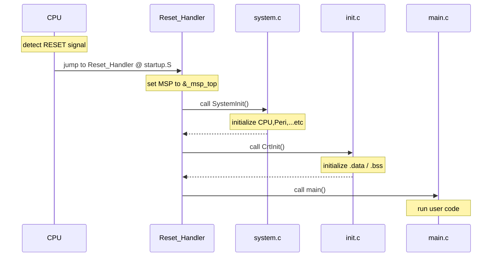

# baremetal-lab 概要

## 1. はじめに

baremetal-lab は ARM CMSIS.5.9.0 の構成を参照しつつ、
Microsoft Copilot との対話を通じて最小構成として再構築したものです。
GNU Make ベースのビルドシステム、スタートアップコード、リンカスクリプト、
そして C ランタイムの構成は、その対話の積み重ねによって形になりました。

本章では、baremetal-lab のアーキテクチャと各レイヤの役割を説明します。

## 2. ディレクトリ構成

| ディレクトリ | 役割 |
|-------------|------|
| `arch/`     | CPU アーキテクチャ依存コード |
| `docs/`     | プロジェクトのドキュメントを配置するディレクトリ |
| `external/` | 外部由来のSWコンポーネントを配置するディレクトリ。各コンポーネントのライセンスに従って扱う。 |
| `include/`  | 各レイヤが公開するヘッダファイル |
| `main/`     | ユーザアプリケーション（サンプルコード） |
| `runtime/`  | C ランタイム相当の最小機能 |
| `platform/` | SoC / ボード依存コード |
| `tools/`    | Makefile および、外部由来SWコンポーネント取得スクリプト |

## 3. ソフトウェア構造（レイヤの関係）

```
-------------------------------
| main                        |
-------------------------------
| runtime layer               |
-------------------------------
| arch layer | platform layer |
-------------------------------
| CPU        | SoC / Board    |
-------------------------------
```

runtime layer は arch layer と platform layer の両方に依存するため、
縦方向の階層ではなく、横方向の関係として配置しています。
（各レイヤの役割についてはディレクトリ構成を参照）

## 4. 起動シーケンス

システムの電源を投入すると、回路に電圧が供給され、クロックが発振し、リセット信号が生成されます。
これにより CPU はクロック入力を受け、リセット状態に入ります。

CPU はリセット信号を検出すると、リセット例外を実行します。
ここからソフトウェアの世界が動き出します。

この起動シーケンスでは、CPU がリセット例外を実行した後、
ソフトウェアがどのように初期化処理を進め、最終的に main() を呼び出すのかを説明します。



### Cortex-M のリセット時の MSP 設定について

Cortex-M では、例外が発生すると MSP（Main Stack Pointer）にはベクタテーブルの先頭ワードに格納された値が自動的にロードされます。
そのため、本来であれば Reset_Handler 内で MSP を設定するコードを記述する必要はありません。

baremetal-lab の Reset_Handler では、以下のような「リセット例外が発生しない状況」を考慮し、
「MSP を常に正しい値に初期化する」という方針で実装しています。

- デバッガによるリロード  
既にプログラムが実行されている状態で、デバッガを接続してプログラムをリロード・再実行する場合、
リセット例外が発生しないので、MSP が期待した値になっていない可能性がある。

- 2 段ブートのケース  
リセット例外ではなく、前段のブートローダから baremetal-lab が呼び出される場合、
MSP が期待した値になっていない可能性がある。

## 5. arch layer（CPU 依存コード）

| ファイル                   | 役割 |
|---------------------------|------|
| `arch/armv6-m/int.c`      | CPUの例外制御を抽象化した API を提供する |
| `arch/armv6-m/irq.c`      | 割り込みコントローラ（armv6-m では NVIC）の IRQ 制御 API を提供する |
| `arch/armv6-m/startup.S`  | `Reset_Handler` を定義する。baremetal-lab はここから始まる（起動シーケンス参照）。 |

[arch layer の詳細はこちらをご参照ください。](03_arch.md)

## 6. runtime layer（最小 C ランタイム）

| ファイル             | 役割 |
|---------------------|------|
| `runtime/init.c`    | `.data` / `.bss` セクションの初期化 |
| `runtime/mem.c`     | `memcpy` / `memset` を提供 |
| `runtime/console.c` | `console_putc` / `console_puts` を提供し、`platform_uart_*` に委譲 |

[runtime layer の詳細はこちらをご参照ください。](04_runtime.md)

## 7. platform layer（SoC / ボード依存コード）

- `platform/qemu-lm3s6965evb/`
  - `system.c` : CPU、ペリフェラルなどの初期化
  - `uart.c` : UART ドライバ（QEMU 用の最小実装）
  - `vector.c` : 例外ベクタテーブル
  - `qemu-lm3s6965evb.ld` : リンカスクリプト
  - `platform.h` : platform 依存定義

[platform layer の詳細はこちらをご参照ください。](05_platform.md)
